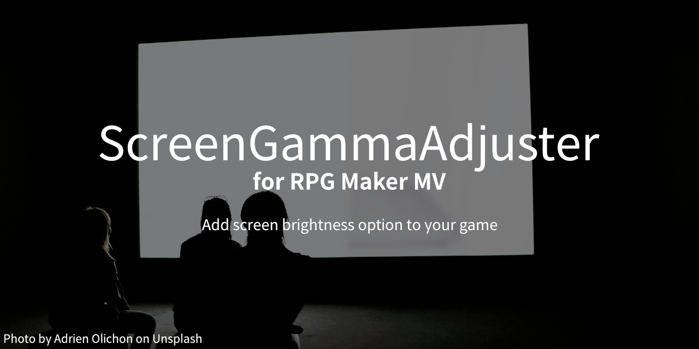

  

### [Download plugin](https://github.com/Creta5164/rpg-maker-mv-screen-gamma-adjuster/releases)

This plugin just adds a simple screen gamma adjustment option.

You can put this plugin and go directly option menu to check new gamma settings.                                   

Created by Creta Park (https://creft.me/cretapark)  

This plugin is free for use, just leave my name in your game's credits!

Most instructions and setup are included in the plugin description.

*Currently recommanded MV version is `1.6.2`.*

## Sponsors

This plugin is made possible by donations from these backers, thank you all kind of support!

- [Gustav][gustav]
- [DECENT TREATMENT][decent-treatment]

[gustav]: https://mitenbets.wixsite.com/gustav
[decent-treatment]: https://linktr.ee/decenttreatment